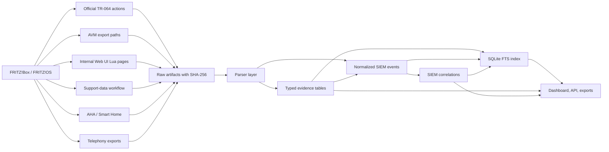
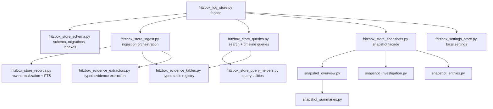
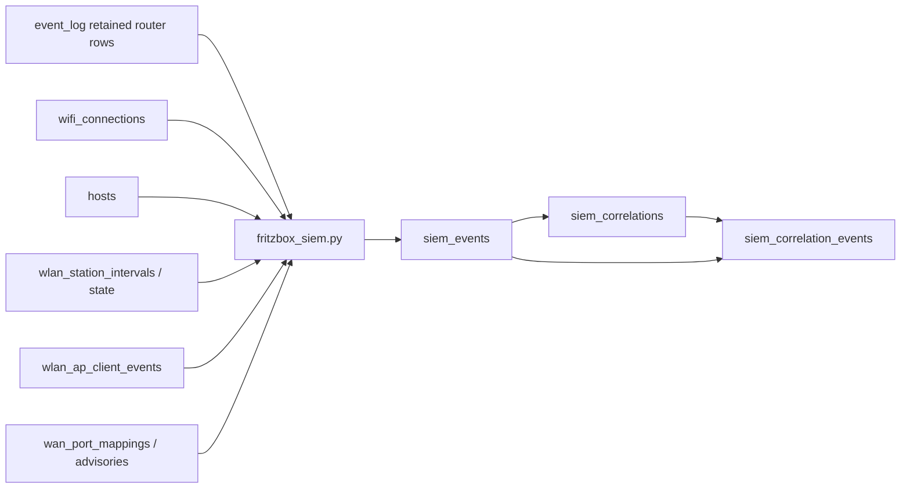
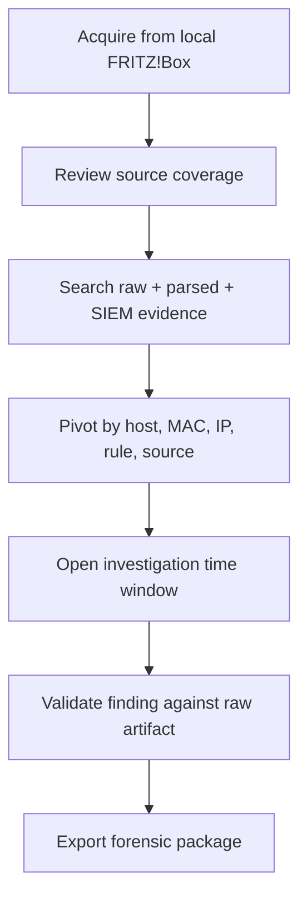
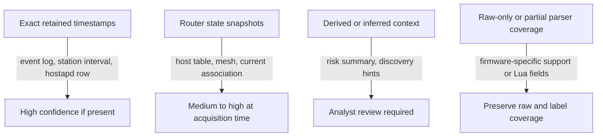

# Architecture And Flowcharts

This page gives maintainers and analysts a visual map of how FRITZ!Box Forensik SIEM moves from router surfaces to raw evidence, typed evidence, normalized SIEM events, and dashboard views.

The diagrams are Mermaid flowcharts so they stay reviewable in Git, render on GitHub, and can be changed alongside the code.

## Evidence Pipeline

## Storage Modules

## SIEM Normalization

## Analyst Workflow

## Source Trust Model

## Research Notes

The official FRITZ! development page documents TR-064 as a local-network protocol and lists the current service families used by this project, including WAN, hosts, WLAN, telephony, app setup, device info, and smart-home interfaces. It also documents the AHA/Smart Home interfaces and points developers to `support.lua` for support information generation.

Because FRITZ!OS internal Web UI Lua schemas and support-data sections are firmware-dependent, this project keeps raw artifacts first and treats typed parser rows as derived views over those artifacts.
