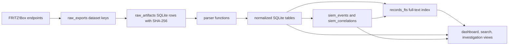

# Evidence Model

The analyzer is raw-first. Every acquisition keeps router-returned artifacts before parsing. Parsed tables and UI summaries are derived views over those artifacts.

## Acquisition Flow

## Core SQLite Tables

| Table | What it stores | Primary evidence level |
|---|---|---|
| `export_runs` | Acquisition metadata, router metadata, source endpoint inventory, timestamp assumptions. | Metadata |
| `raw_artifacts` | Raw XML/JSON/text/config/support artifacts. | `raw` |
| `event_log` | Parsed retained router log rows. | `parsed_from_raw` |
| `wifi_connections` | Exact or derived WiFi-related observations. | Mixed |
| `hosts` | Current/known host context from TR-064 and internal LAN-device state. | `enriched_from_current_host_table` |
| `support_findings` | Generic key/value and line-level findings from support/data/query artifacts. | `parsed_from_raw` |
| `record_observations` | Per-run observation snapshots for timelines and comparisons. | Mixed |
| `records_fts` | SQLite FTS5 content index. | Search index |
| `siem_events` | Normalized local SIEM events promoted from retained logs and typed evidence. | Mixed, source-labeled |
| `siem_correlations` | Rule/entity/window findings generated from SIEM events. | Derived from linked evidence |
| `siem_correlation_events` | Links between correlation findings and supporting SIEM events. | Link table |
| `host_filter_profiles` | Parental/filter/profile state. | `parsed_from_raw` |
| `mesh_topology_links` | Mesh parent/peer/link observations. | `parsed_from_raw` |
| `wan_port_mappings` | Port sharing / WAN exposure rules. | `parsed_from_raw` |
| `wlan_radios` | WLAN radio state and counters. | `parsed_from_raw` |
| `wlan_associations` | Current WLAN association snapshots. | `parsed_from_raw` |
| `wlan_station_state_snapshots` | Support/Lua WLAN station state snapshots. | `parsed_from_raw` |
| `wlan_station_intervals` | Retained support-data station history intervals. | `parsed_from_raw` |
| `wlan_ap_client_events` | hostapd/AP-side authentication and association lifecycle rows. | `parsed_from_raw` |
| `wlan_event_details` | Parsed support-data WLAN event detail rows. | `parsed_from_raw` |
| `dhcp_leases` | DHCP lease state from internal pages where available. | `parsed_from_raw` |
| `advertisement_hints` | UPnP/PCP/mDNS/SSDP/multicast hints and WLAN scan-result context. | Low to medium confidence |
| `network_status_snapshots` | WAN/DSL/LAN/WLAN counters and state snapshots. | `parsed_from_raw` |
| `device_risk_summaries` | Derived per-device review flags. | `inferred` |
| `security_advisories` | Derived router/device security review findings. | Mixed, verify raw |
| `telephony_records` | Call list and phonebook metadata when collected. | `parsed_from_raw`, sensitive |
| `aha_device_states` | FRITZ!DECT/AHA smart-home inventory and state. | `parsed_from_raw`, sensitive |

## Confidence Vocabulary

| Label | Meaning | Example |
|---|---|---|
| `raw` | Exact artifact retained as collected. | `support_data_txt` stored with SHA-256. |
| `parsed_from_raw` | Structured row parsed from a raw artifact. | Device log row with timestamp and message. |
| `enriched_from_current_host_table` | Entity context from current/known router state. | Hostname added to a MAC from host table. |
| `inferred` | Analyst-friendly conclusion derived from multiple fields. | Device risk score from UPnP and WAN mapping state. |
| `exact` | Timestamp is present in retained raw evidence. | Event-log timestamp. |
| `derived` | Timestamp is produced from state or another observation. | Mesh `last_connected` value. |
| `low` | Useful context, but not proof of a precise action. | Broadcast keyword hit in support data. |

## Time Semantics

FRITZ!Box evidence mixes multiple time types:

- Wall-clock timestamps in retained event logs.
- Router-state timestamps such as `firstused`, `lastused`, and mesh `last_connected`.
- Acquisition time for snapshots with no embedded event time.
- Kernel uptime/monotonic times in support diagnostics.
- Counter values without event times.

The UI must not collapse these into a single meaning. A row that says a device was `lastused` at a time is not the same as a full session interval.

## Investigation View Semantics

The investigation view answers:

- Which devices have retained evidence inside this time window?
- Which devices were connected or known to the FRITZ!Box from retained station/session state?
- Which devices or services produced network-layer discovery hints?
- Was true 802.11 probe-request management-frame telemetry retained?

It does **not** prove:

- A complete list of every nearby phone.
- Continuous connection duration unless a retained interval exists.
- Packet-level broadcast attribution.
- User identity behind a client device.

## Raw-Only Coverage

Some collected artifacts are intentionally raw-first or partially parsed:

- Most `data.lua` pages.
- Some `query.lua` namespaces.
- Telephony and AHA artifacts.
- Encrypted configuration exports.
- Large sections of support data.

This is by design. The source coverage UI should make it visible whether an artifact is fully structured, partially parsed, or retained only as searchable raw evidence.

## SIEM Event Semantics

`siem_events` are local normalized events, not evidence by themselves. Each row keeps source, confidence, evidence level, record type, record ID, parser/rule fields, tags, and searchable text so the analyst can pivot back to the raw or typed row.

`siem_correlations` are review findings. They are useful for triage, but they should be validated against the linked rows in `siem_correlation_events` and the original raw artifacts before making a remediation decision.
